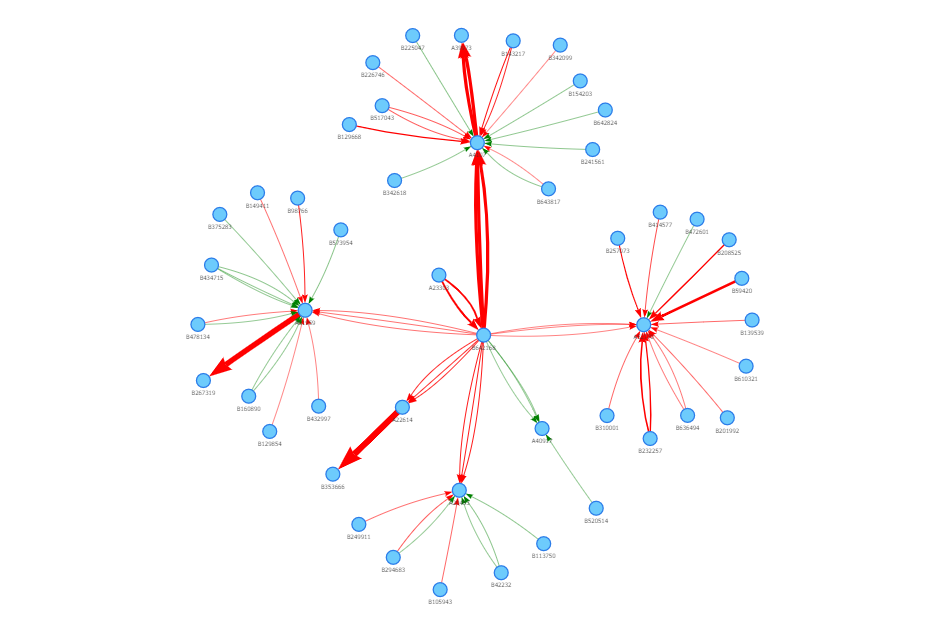
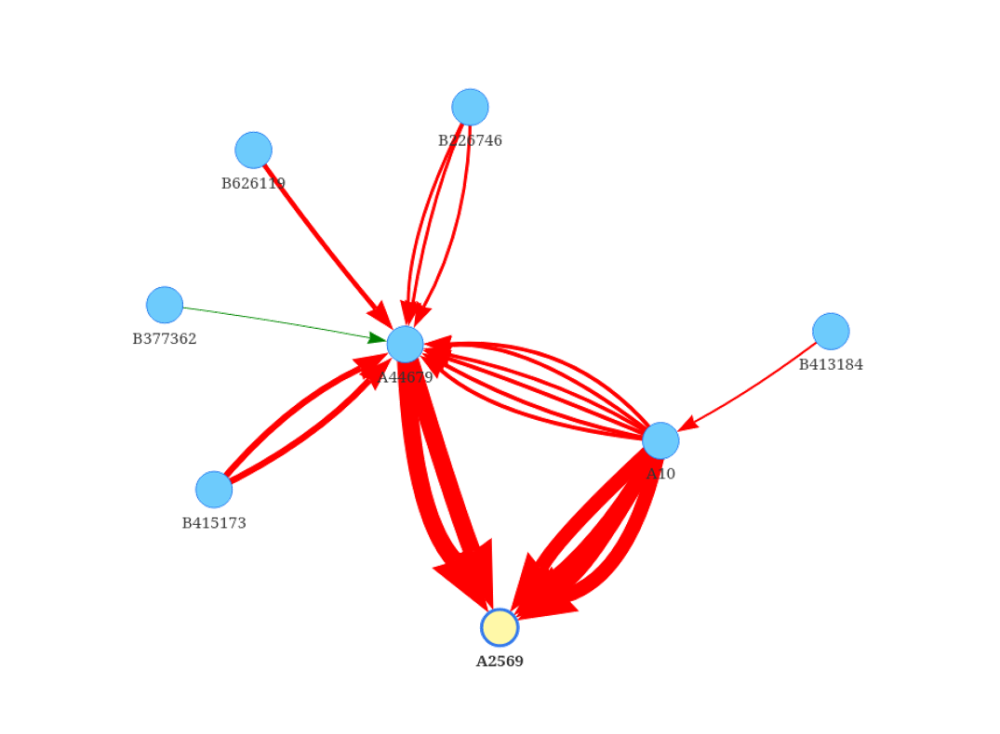

## Bank transaction dashboard  
Designing a dashborad for bank with following functionalities which I developed:  
• Tracking transactions of two predefined accounts with others by network visualization  

  

• Finding the transactions between two selected account in dashboard specially potential links which cannot be seen easily in table format of data  

  

• Calculating similarity of each pair accounts (using SimRank algorithm) based on the number of in coming & out going edges to know how much two accounts are similar, specially in the case of labeling (blacklist, red list, white list)

Python libraries: **Pyvis , Networkx** 

